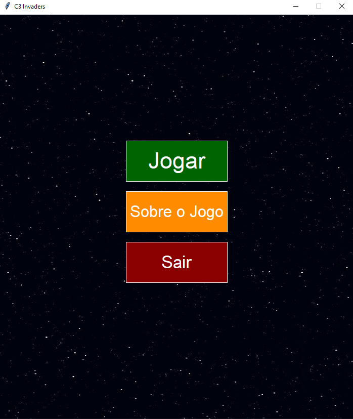
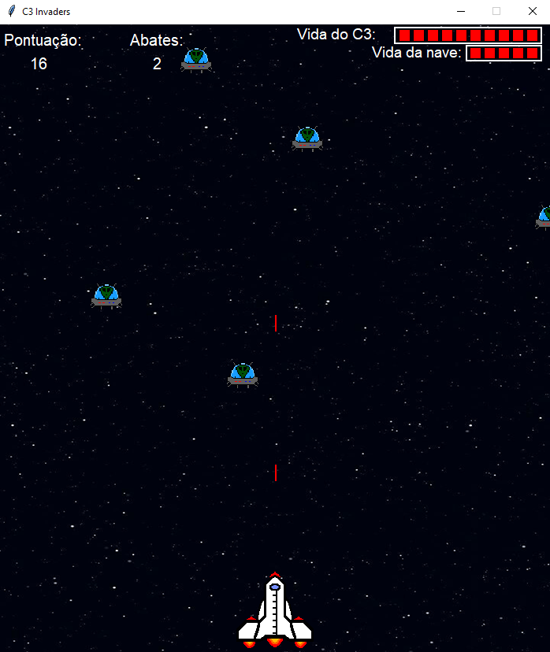
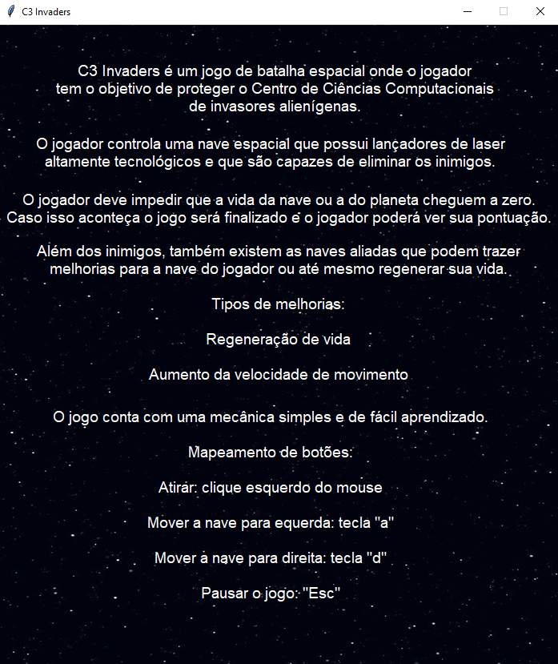
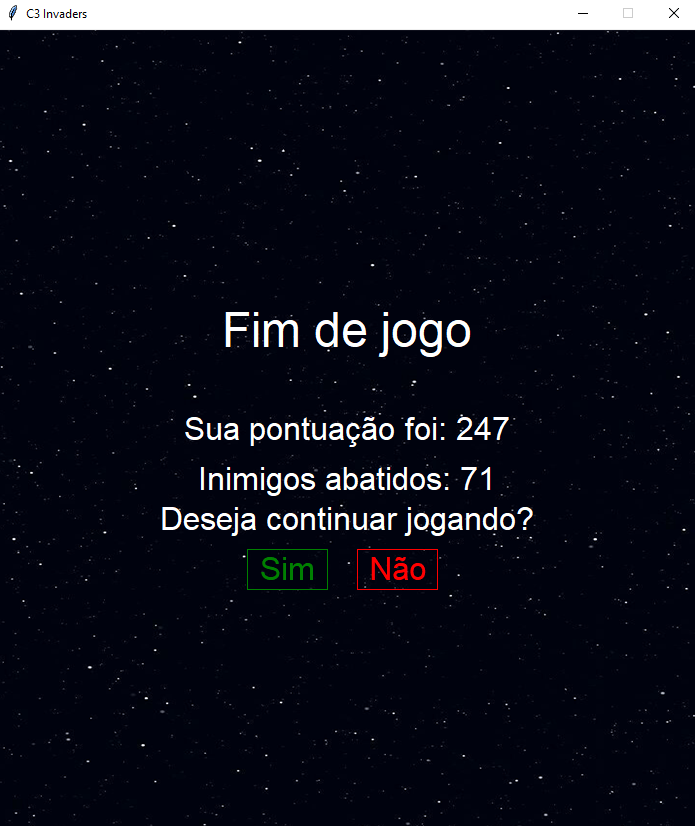

# Jogo-C3-Invaders
Similar ao Space Invaders, C3 Invaders é um jogo desenvolvido em Python, através da biblioteca Graphics. É um trabalho acadêmico, desenvolvido na disciplina de Algoritmos e Estrutura de Dados I, no ano de 2022. O objetivo é exercitar a lógica de programação, além da manipulação de diversos tipos de dados, e exploração da sintaxe e recursos da linguagem Python. Dessa forma, não foram aplicados conteúdos mais profundos como o paradigma de programação orientada a objetos.

